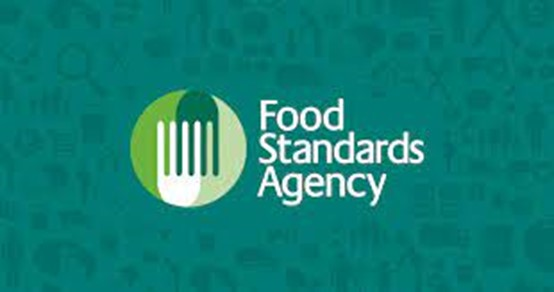
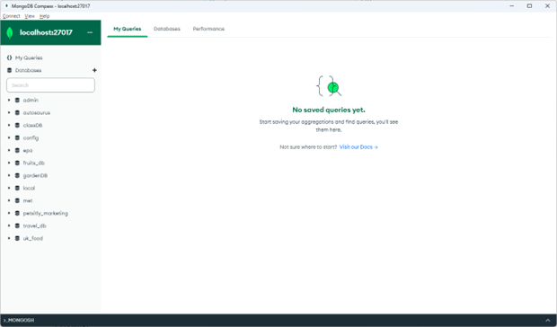

# UK Food Standards Agency 
# Eat Safe, Love (NoSQL)

## Overview of Project
The purpose of this project is to evaluate restaurante ratings in order to assist journalists and food critics in identifying the establishments to focus on for future articles.

The following steps were completed to analyze the ratings data:
<ul> •	Imported the available JSON data </ul>
<ul> •	Created a Mongo Client instance and created a new database </ul>
<ul> •	Updated and cleaned the database documents </ul>
<ul> •	Conducted exploratory analysis based on rating values </ul>

## Results

## Resources
### Data Source:
establishments.json

### Software:
Jupyter, Python, Pandas, MongoDB Compass, VSCode